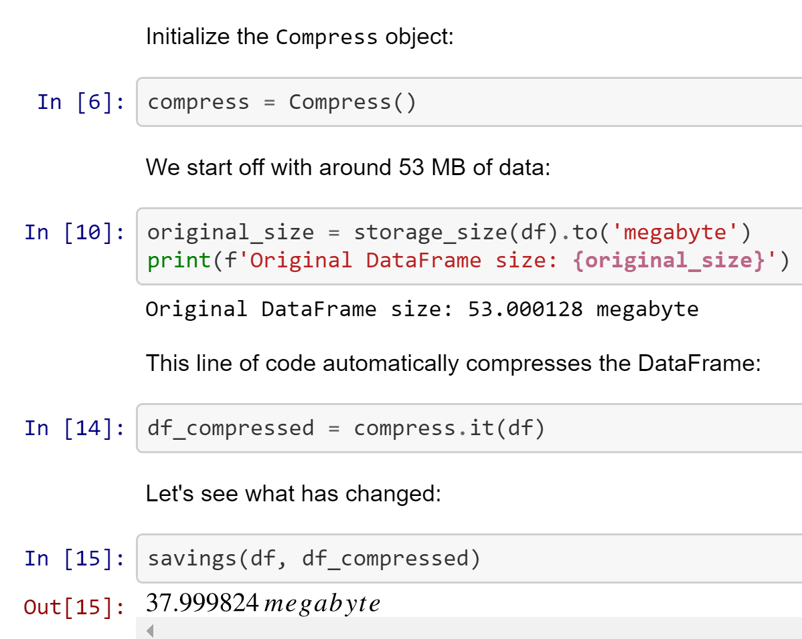

# Compressio

Lossless in-memory compression of pandas DataFrames and Series powered by the [visions](https://github.com/dylan-profiler/visions) type system. Up to 10x less RAM needed for the same data. 

Compressio automates minimizing the amount of memory required for your data (and the amount of work you have to do to achieve that!). 

The general framework is not limited to specific compression strategies.
Customizing compressio is as simple as providing a mapping of compression functions for the types in your dataset.

Yet compressio ships with powerful compression algorithms that can help optimize your memory usage to up til 10x. 
These algorithms can be subdivided into these optimization strategies:

1. Use smaller dtypes when the data can do with lower precision without losing information
2. Consider (more efficient) data representations 
3. Compress the data using more efficient data structures

(2. is where things get messy without visions)

### 1. Smaller dtypes

Pandas uses numpy arrays to store data, where the `dtype` specifies the array's kind of data.
For instance numbers might be stored as 64-bit integers (`int64`), 8-bit unsigned integers (`uint8`) or a 32-bit floating point number (`float32`).
Read the numpy type [overview](https://numpy.org/doc/stable/user/basics.types.html) for details.

Different types require different amounts of memory; a 8-bit integer requires only 1/8th the memory of what a 64-bit integer would need.

```python
import numpy as np

array_int_64 = np.ones((1000, 1000), dtype=np.int64)
print(array_int_64.nbytes)
8000000

array_int_8 = np.ones((1000, 1000), dtype=np.int8)
print(array_int_8.nbytes)
1000000
```

As you can see, the 8-bit integer array decreases the memory usage by 87.5%.

### 2. Appropriate machine representation

**This feature is in progress**

Compressio uses visions' to infer the semantic type of the data and minimized the memory needed by changing the computer representation while keeping the semantic type constant.

For instance visions can infer and cast to the following series automatically, yielding a 4x memory improvement: 

```python
>>>> import pandas as pd
>>>> # dtype: object
>>>> series = pd.Series([True, False, None, None, None, None, True, False] * 1000)
>>>> print(series.nbytes)
64000

>>>> # dtype: boolean (pandas' nullable boolean)
>>>> new_series = series.astype("boolean")
>>>> print(new_series.nbytes)
16000
```

Further background information is available in the [visions documentation](https://dylan-profiler.github.io/visions/visions/applications/compression.html), [github repository](https://github.com/dylan-profiler/visions) and [JOSS publication](https://joss.theoj.org/papers/10.21105/joss.02145).

### 3. Efficient data structures

**This feature is in progress**

Without additional instructions, pandas represents your data as *dense* arrays. This is a good all-round choice. 

When your data is not randomly distributed, it can be compressed ([Theory](https://simonbrugman.nl/2020/04/02/searching-for-neural-networks-with-low-kolmogorov-complexity.html#kolmogorov-complexity)).

Data that consists mostly of a single value can be more efficiently stores in [sparse data structures](https://pandas.pydata.org/pandas-docs/stable/reference/api/pandas.arrays.SparseArray.html#pandas.arrays.SparseArray), which are provided by pandas by default. 
The sparse data structure is more efficient in this case by storing the predominant value only once and instead keeping indices for all other values.

Optimization of data structures is not limited to sparse arrays. 
For example [run-length encoding (RLE)](https://www.dlsi.ua.es/~carrasco/papers/RLE%20-%20Run%20length%20Encoding.html) can be used to compress sequential data. 
We take note that a pandas-specific third-party implementation is under development: [RLEArray](https://github.com/JDASoftwareGroup/rle-array).

## Usage

### Installation

You can install compressio through pip:
```
pip install compressio
```

Alternatively, you can clone this github repository:

```
git clone https://github.com/dylan-profiler/compressio.git
```

### Compressing DataFrames



The notebook [here](examples/notebooks/Compressio.ipynb) contains an example to get you started.
Several other Jupyter notebooks are available in the [examples directory](examples/notebooks/). 

## Optimizing strings in pandas

Pandas allows for multiple ways of storing strings: as string objects or as `pandas.Category`. Recent version of pandas have a `pandas.String` type.

How you store strings in pandas can significantly impact the RAM required. 


The key insights from this analysis are:
- The Category is more memory efficient when values are recurring and the String representation the percentage of distinct values. 
- The size of the Series is _not_ decisive for the string representation choice.

You can find the full analysis [here](blob/master/examples/notebooks/Compressio.ipynb).
