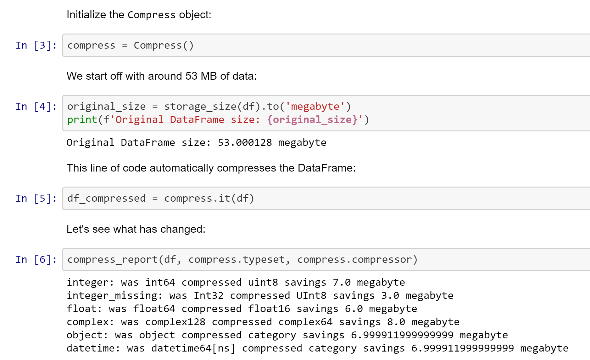
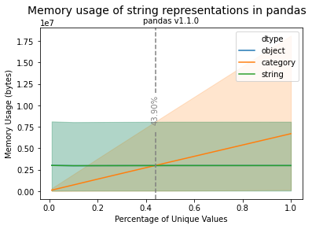

# Compress*io*

> Compressio provides lossless in-memory compression of pandas DataFrames and Series powered by the [visions](https://github.com/dylan-profiler/visions) type system. Use up to 10x less RAM with the same data!

Getting started is as easy as

```python
from compressio import Compress

compress = Compress()
compressed_data = compress.it(data)

```


## The Framework

Compressio is a general framework for automated data compression and representation management not limited to any specific compression algorithm or implementation.
You have complete control, define your own types, write your own compression algorithms, or get started with the large library of types provided by [visions](https://dylan-profiler.github.io/visions/visions/api/types.html) and the suite of powerful algorithms included in compressio by default.


These algorithms can be subdivided around three basic optimization strategies:

1. Prefer smaller dtypes where possible without loss of information
2. Consider (more efficient) data representations*
3. Compress data using more efficient data structures

\* this is where things get messy without visions

### 1. Smaller dtypes

Under the hood, pandas leverages numpy arrays to store data.
Each numpy array has an associated `dtype` specifying a physical, on disk, representation of the data.
For instance, a sequence of integers might be stored as 64-bit integers (`int64`), 8-bit unsigned integers (`uint8`) or even 32-bit floating point number (`float32`).
An overview of the numpy type system can be found [here](https://numpy.org/doc/stable/user/basics.types.html).

These type differences have numerous computational implications, for example, where an 8 bit integer can represent numbers between 0 and 255, the range of a 64 bit integer is  between -9,223,372,036,854,775,808 and 9,223,372,036,854,775,807 at the cost of an 8x larger memory footprint.
There can also be computational performance implications for different sizes.

```python
import numpy as np

array_int_64 = np.ones((1000, 1000), dtype=np.int64)
print(array_int_64.nbytes)
8000000

array_int_8 = np.ones((1000, 1000), dtype=np.int8)
print(array_int_8.nbytes)
1000000
```

As you can see, the 8-bit integer array decreases the memory usage by 87.5%.

### 2. Appropriate machine representation

Compressio uses visions to infer the semantic type of data and coerce it into alternative computational representations which minimize memory impact while maintaining it's semantic meaning.


For instance, although pandas can use the generic object dtype to store boolean sequences, it comes at the cost of a 4x memory footprint.
Visions can automatically handle these circumstances to find an appropriate representation for your data.

```python
>>>> import pandas as pd
>>>> # dtype: object
>>>> series = pd.Series([True, False, None, None, None, None, True, False] * 1000)
>>>> print(series.nbytes)
64000

>>>> # dtype: boolean (pandas' nullable boolean)
>>>> new_series = series.astype("boolean")
>>>> print(new_series.nbytes)
16000
```

Further background information is available in the [visions documentation](https://dylan-profiler.github.io/visions/visions/applications/compression.html), [github repository](https://github.com/dylan-profiler/visions) and [JOSS publication](https://joss.theoj.org/papers/10.21105/joss.02145).

### 3. Efficient data structures

Without additional instructions, pandas represents your data as *dense* arrays. This is a good all-round choice. 

When your data is not randomly distributed, it can be compressed ([Theory](https://simonbrugman.nl/2020/04/02/searching-for-neural-networks-with-low-kolmogorov-complexity.html#kolmogorov-complexity)).

Low cardinality data can often be more efficiently stored using [sparse data structures](https://pandas.pydata.org/pandas-docs/stable/reference/api/pandas.arrays.SparseArray.html#pandas.arrays.SparseArray), which are provided by pandas by default. 
These structures offer efficiency by storing the predominant values only once and instead keeping indices for all other values.

[This notebook](examples/notebooks/Sparse%20Data.ipynb) shows how to use compressio with sparse data structures.

Data structure optimization is not limited to sparse arrays but instead include numerous domain specific opportunities such as [run-length encoding (RLE)](https://www.dlsi.ua.es/~carrasco/papers/RLE%20-%20Run%20length%20Encoding.html) which can be applied to compress sequential data. 
We note that a pandas-specific third-party implementation is currently under development: [RLEArray](https://github.com/JDASoftwareGroup/rle-array).

## Usage

### Installation

You can easily install compressio with pip:

```
pip install compressio
```

Or, alternatively, install from source.

```
git clone https://github.com/dylan-profiler/compressio.git
```

### Examples

[](examples/notebooks/Compressio.ipynb).

There is a collection of example notebooks to play with in the [examples directory](examples/notebooks/) with a quick start notebook available [here](examples/notebooks/Compressio.ipynb).

## Optimizing strings in pandas

Pandas allows for multiple ways of storing strings: as string objects or as `pandas.Category`. Recent version of pandas have a `pandas.String` type.

How you store strings in pandas can significantly impact the RAM required. 

[](examples/notebooks/pandas%20string%20type%20analysis.ipynb)

The key insights from this analysis are:
- The Category is more memory efficient when values are recurring and the String representation the percentage of distinct values. 
- The size of the Series is _not_ decisive for the string representation choice.

You can find the full analysis [here](examples/notebooks/pandas%20string%20type%20analysis.ipynb).

## Gotcha's

Compressing DataFrames can be helpful in many situations, but not all.
Be mindful of how to apply it in the following cases:

- _Overflow_: compression by dropping precision can lead to overflows if the array is manipulated afterwards. 
This can be an issue for instance for [numpy integers](https://mortada.net/can-integer-operations-overflow-in-python.html). In case this is a problem for your application, you can explicitly choose a precision.

- _Compatibility_: other libraries may make different decisions to how to handle your compressed data.
One example where code needs to be adjusted to the compressed data is when the sparse data structure is used in combination with [`.groupby`](https://pandas.pydata.org/pandas-docs/stable/reference/api/pandas.DataFrame.groupby.html). (`observed` must be set to `True`).
This [article](https://pythonspeed.com/articles/numpy-memory-footprint/#when-these-strategies-wont-work) provides another example of scikit-image, which for some functions immediately converts a given array to a float64 dtype.
